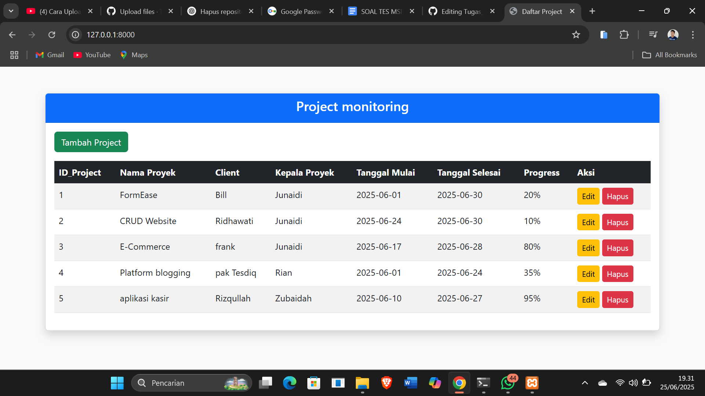
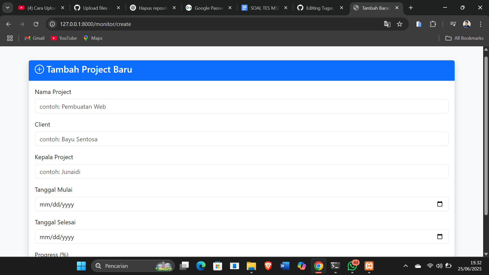
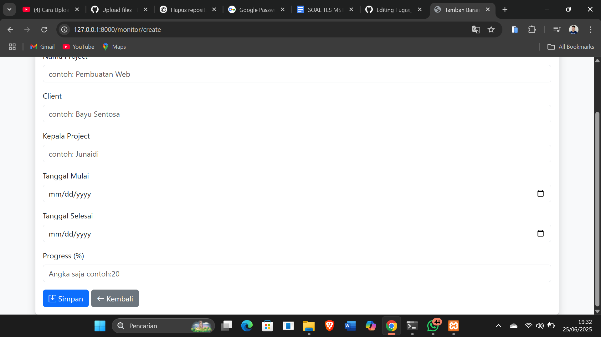
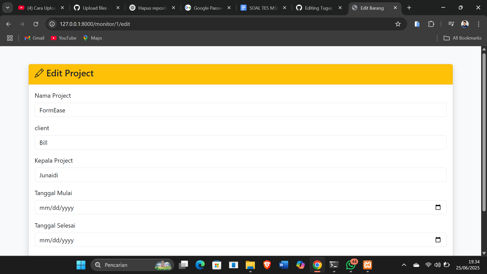
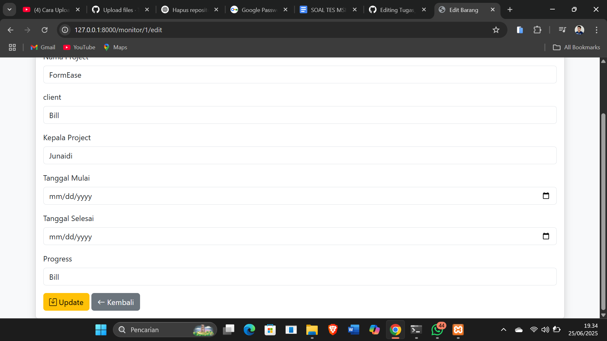

# Tugas Digitaliz – Laravel Project

Project ini dibuat untuk memenuhi tes magang.  
Fitur utama dari aplikasi ini meliputi:

- ✅ CRUD data (Create, Read, Update, Delete)
- ✅ FRAMEWORK Frond-end Boostrap (CSS)
- ✅ FRAMEWORK Back-end Laravel (PHP)
- ✅ Database MYSQL (XAMPP)
- ❌ Upload foto belum bisa (masih dipelajari)
- ✅ Tanpa login (sesuai ketentuan tugas)
- 🔍 Filter / Search / Pagination (opsional)

---

## 📸 Screenshot Tampilan Project

### Halaman Utama CRUD

### Form Tambah Data

### Form Edit Data

---
